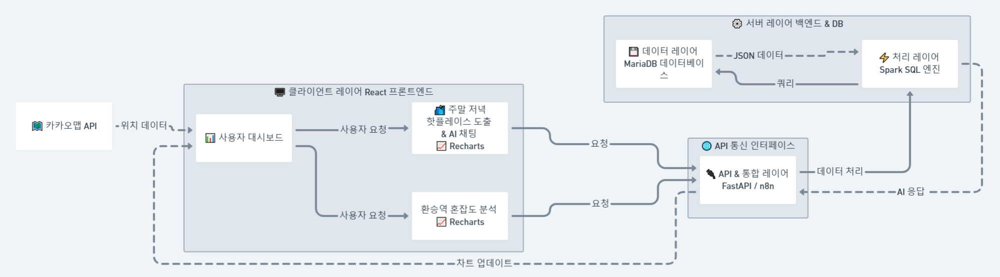
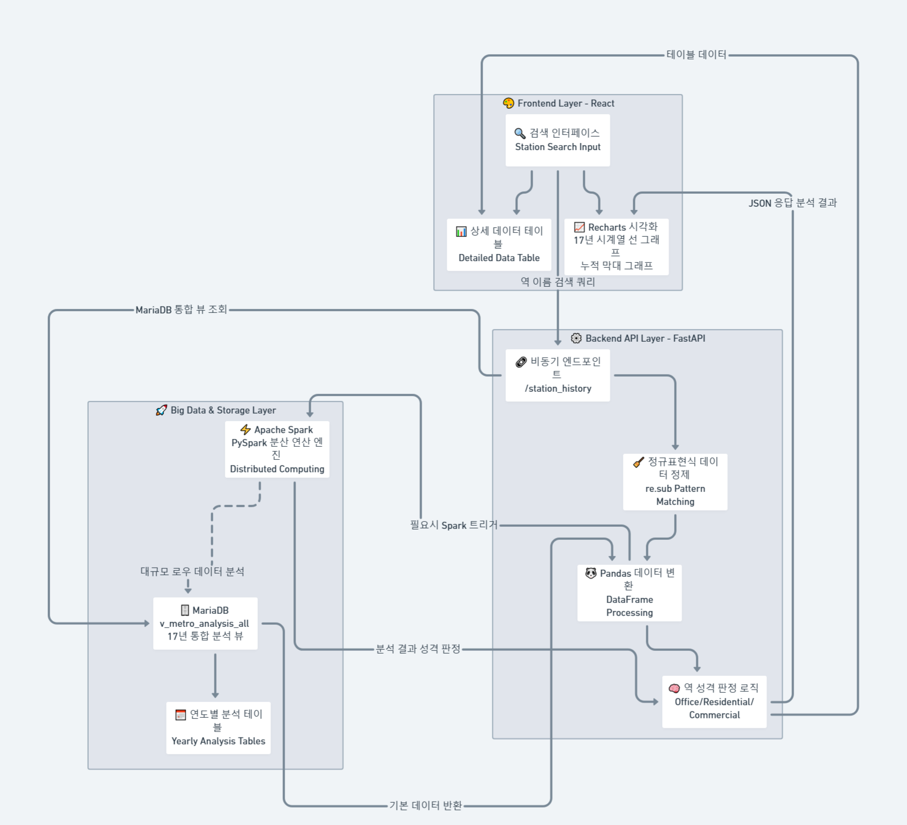
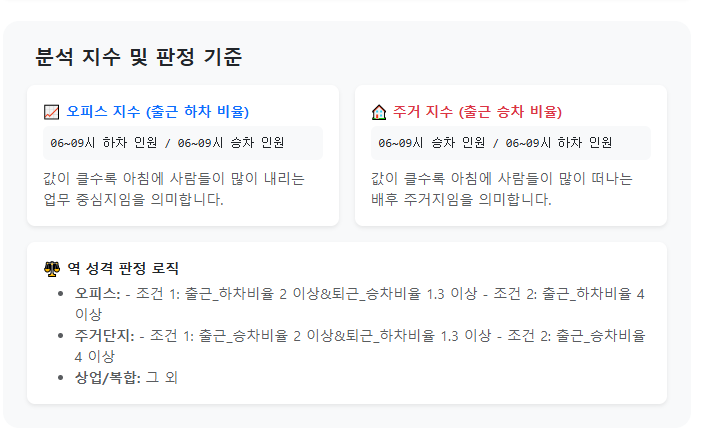
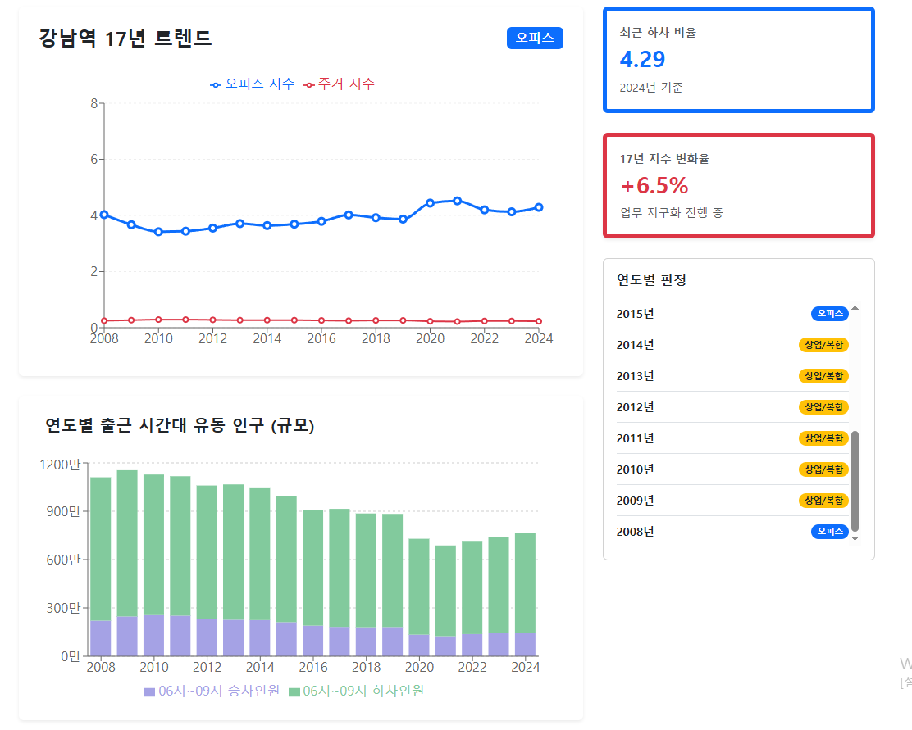
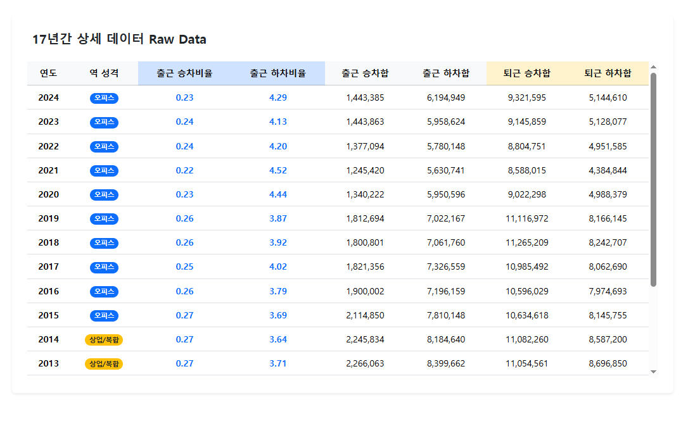
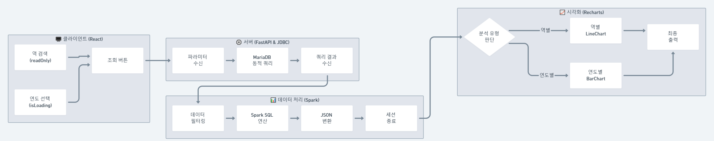
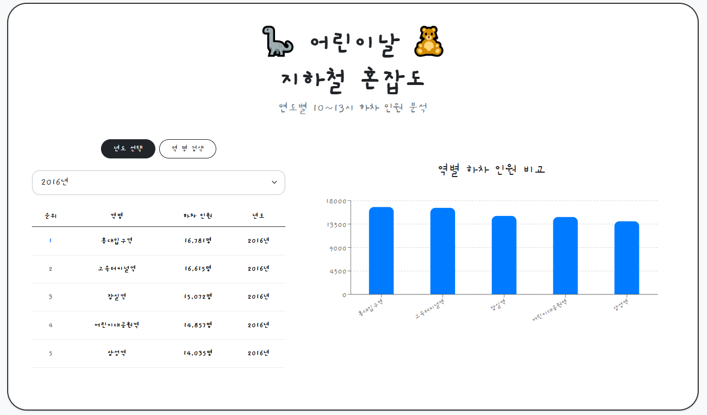

# 0318

1. 기간
진행 : 3/20(금) 8교시까지
발표 : 3/23(월)

2. 주요 수행 내용
데이터 처리 : 스파크 이용 - 지하철 유동인구 데이터
시각화 : 리액트 이용  
문서 작업 : 기능 정의서, 기술 스택 정리, WBS, PPT

3. 진행 계획
3/18(수) : 스파크(pyspark) 이용 순유입량 및 역 성격 데이터 적재
3/19(목) : 시각화 / 분석 정리
3/20(금) : 프로젝트 보완 / ppt 작성, 발표 준비

<br/>
<br/>
<br/>

# Project 01. 🍗 주말 저녁시간대 번화가 도출 및 맛집 추천 🍕
> **주말 (금, 토, 일요일) 특정시간대 (20~23시) 하차 인원을 분석해 인기가 많은 지역의 맛집을 추천하는 시스템**

## 📌 Project Overview
금, 토, 일요일의특정 시간대(20~23시) 지하철 하차 인원 데이터를 수집하여 상권이 활성화 된 지역을 추출 후 AI를 이용해 주변의 맛집 추천

## 🛠 Tech Stack
- **Frontend**: React, Recharts, Axios, Bootstrap, ReactMarkdown, rehypeHighlight
- **Backend**: FastAPI (Python), SQLAlchemy, N8N, Pandas
- **Big Data**: Apache Spark (PySpark)
- **Database**: MariaDB, PostGres
- **DevOps**: Docker

## 🏗 System Architecture



## 📊 실시간 시각화 대시보드

~~Recharts를 활용해 특정 시간대의 승하차 인원 합계와 비율을 시각화, 오피스/주거 예상 비율을 도출한다.~~

## 🔍 핵심 쿼리 로직 (Core Logic)

### spark용 sql
```sql
SELECT
          `역명`,
          Floor(AVG(CAST(`20~21` AS INT) + CAST(`21~22` AS INT) + CAST(`22~23` AS INT)), 0) AS `night_avg`
        FROM jhYearTable
        WHERE (`주말여부` = 1
          OR DAYOFWEEK(CAST(`날짜` AS DATE)) = 6)
          AND `구분` = '승차'
        GROUP BY `역명`
        ORDER BY night_avg DESC
        LIMIT 10
```

## 🔨 트러블 슈팅 레포트
### 1. 대용량 데이터 처리 및 시스템 부하 문제
- **Problem**: 서울시 지하철 이용 데이터 약 1,100만 행을 일반적인 DB 쿼리로만 처리할 때 속도가 저하되고 시스템 부하가 발생함.

- **Solution**: MariaDB에서 필요한 날짜(5/5)와 시간대(10~13시)만 1차 필터링한 후, **Apache Spark(PySpark)**의 분산 처리 엔진을 활용하여 메모리 내 연산으로 속도를 최적화함.

- **Result**: 전체 데이터 전수 조사 대비 분석 속도를 획기적으로 단축하고, 복잡한 랭킹 로직(ROW_NUMBER)을 안정적으로 수행함.

### 2. 리액트 차트 렌더링 동기화 오류
- **Problem** 연도를 변경할 때 API 통신 속도와 차트 애니메이션 주기가 맞지 않아, 이전 데이터가 차트에 남거나 로딩 중 차트가 깨져 보이는 현상 발생.

- **Solution** isLoading 상태값에 따라 조건부 렌더링을 적용하고, Recharts의 ResponsiveContainer에 고유 key 값을 부여하여 데이터 업데이트 시 차트가 정확하게 재렌더링되도록 로직 수정.

- **Result** 사용자 경험(UX) 측면에서 매끄러운 화면 전환과 정확한 데이터 시각화 구현.

<br/>
<br/>
<br/>


# Project 02. 👨‍💼 출퇴근 시간의 승하차 비율을 통한 역 성격 변화지표 👩‍💼
> **2008년~2024년 출퇴근 시간대(06~09시, 17~20시) 지하철 승하차 비율을 통한 역 성격 규명 및 시각화 프로젝트**

## 📌 Project Overview
출퇴근 시간대의 승하차 인원을 분석하여, 지역 별 성격을 주거지역과 업무지역으로 나누어 사용자에게 직관적인 시각화 데이터를 제공하는 풀스택 웹 애플리케이션입니다. 2008년~2024년의 데이터를 정제하고 분석한 결과값을 도출해 냅니다.

## 🛠 Tech Stack
- **Frontend**: React, Recharts, Axios, Bootstrap
- **Backend**: FastAPI (Python), SQLAlchemy, Pandas
- **Big Data**: Apache Spark (PySpark)
- **Database**: MariaDB
- **DevOps**: Docker

## 🏗 System Architecture



## 📊 실시간 시각화 대시보드



- Recharts를 활용해 특정 시간대의 승하차 인원 합계와 비율을 시각화, 오피스/주거 예상 비율을 도출한다.

## 🔍 핵심 쿼리 로직 (Core Logic)

### spark용 sql
```sql
SELECT 
            `역번호`, 
            `역명`,
            `출근_승차합`, `출근_하차합`, `퇴근_승차합`, `퇴근_하차합`,
            -- 1. 4대 성격 비율 계산 (이미 계산된 합계를 가져와서 나누기만 하면 됨)
            ROUND(`출근_하차합` / NULLIF(`출근_승차합`, 0), 2) AS `출근_하차비율`,
            ROUND(`퇴근_승차합` / NULLIF(`퇴근_하차합`, 0), 2) AS `퇴근_승차비율`,
            ROUND(`출근_승차합` / NULLIF(`출근_하차합`, 0), 2) AS `출근_승차비율`,
            ROUND(`퇴근_하차합` / NULLIF(`퇴근_승차합`, 0), 2) AS `퇴근_하차비율`,
            -- 2. 역 성격 규명 로직
            CASE 
              -- [오피스 판별]
              WHEN (
                  -- 조건 1: 둘 다 적당히 높음
                  (`출근_하차비율` >= 2.0 AND `퇴근_승차비율` >= 1.3)
                  OR 
                  -- 조건 2: 출근 하차가 압도적 (퇴근 상관 없음)
                  (`출근_하차비율` >= 4.0)
              ) THEN '오피스'
              -- [주거단지 판별]
              WHEN (
                  -- 조건 1: 둘 다 적당히 높음
                  (`출근_승차비율` >= 2.0 AND `퇴근_하차비율` >= 1.3)
                  OR 
                  -- 조건 2: 출근 승차가 압도적 (퇴근 상관 없음)
                  (`출근_승차비율` >= 4.0)
              ) THEN '주거단지'

              ELSE '상업/복합'
            END AS `역성격`
        FROM (
            -- [서브쿼리] 먼저 모든 합계를 계산
            SELECT 
                `역번호`, 
                `역명`,
                SUM(CASE WHEN `구분` = '승차' THEN (CAST(`06~07` AS INT) + CAST(`07~08` AS INT) + CAST(`08~09` AS INT)) ELSE 0 END) AS `출근_승차합`,
                SUM(CASE WHEN `구분` = '하차' THEN (CAST(`06~07` AS INT) + CAST(`07~08` AS INT) + CAST(`08~09` AS INT)) ELSE 0 END) AS `출근_하차합`,
                SUM(CASE WHEN `구분` = '승차' THEN (CAST(`17~18` AS INT) + CAST(`18~19` AS INT) + CAST(`19~20` AS INT)) ELSE 0 END) AS `퇴근_승차합`,
                SUM(CASE WHEN `구분` = '하차' THEN (CAST(`17~18` AS INT) + CAST(`18~19` AS INT) + CAST(`19~20` AS INT)) ELSE 0 END) AS `퇴근_하차합`
            FROM `analysis_{year}`
            GROUP BY `역번호`, `역명`
        )
        ORDER BY CAST(`역번호` AS INT)
```
### 테이블 구성
```sql
// 1. 원본 데이터 (Raw Data)
Table seoul_metro {
  날짜 varchar [pk]
  역번호 varchar [pk]
  역명 varchar
  구분 varchar [note: '승차 또는 하차']
  "06~07" integer
  "07~08" integer
  "08~09" integer
  "09~10" integer
  "10~11" integer
  "11~12" integer
  "12~13" integer
  "13~14" integer
  "14~15" integer
  "15~16" integer
  "16~17" integer
  "17~18" integer
  "18~19" integer
  "19~20" integer
  "20~21" integer
  "21~22" integer
  "22~23" integer
  "23~24" integer
  "24~25" integer
  합계 integer
}

// 2. 연도별 집계 테이블 (집계 로직 포함)
Table metro_flow_2024 {
  역번호 integer [pk]
  역명 varchar
  
  출근_승차합 integer [note: "구분='승차'인 행의 (06~07 + 07~08 + 08~09) 합계"]
  출근_하차합 integer [note: "구분='하차'인 행의 (06~07 + 07~08 + 08~09) 합계"]
  
  퇴근_승차합 integer [note: "구분='승차'인 행의 (17~18 + 18~19 + 19~20) 합계"]
  퇴근_하차합 integer [note: "구분='하차'인 행의 (17~18 + 18~19 + 19~20) 합계"]
  
  출근_하차비율 float [note: '출근_하차합 / 출근_승차합 (오피스 지표)']
  퇴근_승차비율 float [note: '퇴근_승차합 / 퇴근_하차합 (오피스 지표)']
  출근_승차비율 float [note: '출근_승차합 / 출근_하차합 (주거지역 지표)']
  퇴근_하차비율 float [note: '퇴근_하차합 / 퇴근_승차합 (주거지역 지표)']
  역성격 varchar [note: '비율 기반 역 분류 (오피스/주거지역)']
}

// 3. 통합 분석 뷰 (Logical View)
Table metro_flow_view {
  연도 integer [pk]
  역번호 integer [pk]
  역명 varchar
  출근_하차비율 float
  퇴근_승차비율 float
  역성격 varchar
}

// --- 데이터 흐름 관계 설정 ---

// 원본 데이터가 '승하차 구분별 시간대 합계' 로직을 거쳐 집계됨
Ref: seoul_metro.역번호 > metro_flow_2024.역번호

// 연도별 데이터가 UNION ALL로 합쳐져 뷰가 됨
Ref: metro_flow_2024.역번호 < metro_flow_view.역번호
```

## 🔨 트러블 슈팅 레포트
### 1. 대용량 데이터 처리 및 시스템 부하 문제
- **Problem**: 서울시 지하철 이용 데이터 약 330만 행을 일반 SQL 프로그램으로 모든 연산(SUM, ROUND, GROUP BY, CASE WHEN)을 처리하려니 한 번의 테스트에도 시간이 오래 걸림.

- **Solution**: DB에서 데이터를 가져오고 Apache Spark(PySpark)의 분산 처리 엔진을 활용하여 메모리 내 연산으로 속도를 최적화함.

- **Result**: 필요 데이터 가공에 시간이 줄고 안정적으로 테스트 및 데이터 적재를 원활히 함

### 2. 역번호/역명에 따른 데이터 
- **Problem**: 1. 해마다 역명이 조금씩 변하는 경우가 있음. 2. 동일한 역명에 역번호가 여러 개인 역들이 있음.

- **Solution**: 변할 수 있는 역명 대신 고유한 역번호를 기준으로 통합 뷰를 만듬. 역명을 통해 검색하면 데이터 중 최신(2024년) 기준 역명으로 동일한 역명의 역번호 데이터들을 합쳐서 계산.

- **Result**: 집계는 변하지 않는 역번호로 하고 검색은 역명을 통해 할 수 있게 됨.

### 3. 역이름 검색 로직
- **Problem**: 역이름으로 검색 시 동일한 문자열이 포함된 모든 역이 불러와 짐 (ex. 동대문 검색 시 동대문, 동대문역사문화공원이 같이 합산됨)

- **Solution**: 단순 LIKE로 불러오는게 아닌 후보군 중 제일 우선도가 높은 역명을 SELECT하도록 함.

- **Result**: 역들 정보가 섞이지 않고 가장 근접한 역의 정보를 불러옴

<br/>
<br/>
<br/>

# Project 03. 🦕 어린이날 지하철 혼잡도 분석 🧸
> **2008년~2021년 어린이날 하차 데이터를 활용한 나들이 트렌드 시각화 프로젝트**

## 📌 Project Overview
어린이날 가족 나들이객의 하차 인원을 분석하여, 연도별 혼잡 거점의 변화를 파악하고 사용자에게 직관적인 시각화 데이터를 제공

## 🛠 Tech Stack
- **Frontend**: React, Recharts, Axios, Bootstrap
- **Backend**: FastAPI (Python), SQLAlchemy
- **Big Data**: Apache Spark (PySpark)
- **Database**: MariaDB
- **DevOps**: Docker

## 🏗 System Architecture

*사용자 요청부터 MariaDB 필터링, Spark 연산, React 시각화로 이어지는 전체 데이터 파이프라인 설계*

## 💡 가설 & 증명
### 1. 가설
- **가설**: 어린이날 나들이객은 전통적인 가족 단위 테마파크인 '어린이대공원' 인근 역으로 집중될 것이다.

- **배경**: 공휴일 특성상 가족 중심의 야외 활동이 주를 이룰 것이라 판단하여, 어린이대공원역(7호선)의 하차 인원이 압도적일 것으로 예상함.

### 2. 가설 증명
- **가설 부분 수용**: 과거에는 어린이대공원이 독보적이었으나, 시대가 흐름에 따라 '복합 문화 공간'으로 혼잡 거점이 이동함.

- **데이터 증거**: 
 1. 과거 (2000년대 후반~): 가설대로 어린이대공원역의 하차 비율이 최상위권을 유지하며 가족 단위 나들이객의 집중도가 높았음.

 2. 현재 (~2021년): 시간이 지날수록 **홍대입구역(젊은 층의 문화 소비)**과 **고속터미널역(쇼핑 및 복합 쇼핑몰)**의 하차 비율이 가파르게 상승하며 어린이대공원을 추월하거나 대등한 수준에 도달함.

## 📊 실시간 시각화 대시보드

- Recharts를 활용해 특정 시간대의 하차 인원 수 순위를 직관적인 그래프로 구현.

## 🔍 핵심 쿼리 로직 (Core Logic)
```sql
select `역명`,`날짜`,`구분`,`합계`, `순위`
from
(select `역명`,`날짜`,`구분`,
(`10~11`+`11~12`+`12~13`) as 합계,
row_number() over(
	partition by SUBSTRING(`날짜`,1,4)
	order by (`10~11`+`11~12`+`12~13`) desc) as 순위
from metro_db.seoul_metro
where `날짜` like '%05-05'
and `구분` = '하차') tmp
where 순위 <= 5
order by `날짜`,`합계` desc;
```

## 🔨 트러블 슈팅 레포트
### 1. 대용량 데이터 처리 및 시스템 부하 문제
- **Problem**: 서울시 지하철 이용 데이터 약 330만 행을 일반적인 DB 쿼리로만 처리할 때 속도가 저하되고 시스템 부하가 발생함.

- **Solution**: MariaDB에서 필요한 날짜(5/5)와 시간대(10~13시)만 1차 필터링한 후, **Apache Spark(PySpark)**의 분산 처리 엔진을 활용하여 메모리 내 연산으로 속도를 최적화함.

- **Result**: 전체 데이터 전수 조사 대비 분석 속도를 획기적으로 단축하고, 복잡한 랭킹 로직(ROW_NUMBER)을 안정적으로 수행함.

### 2. 리액트 차트 렌더링 동기화 오류
- **Problem** 연도를 변경할 때 API 통신 속도와 차트 애니메이션 주기가 맞지 않아, 이전 데이터가 차트에 남거나 로딩 중 차트가 깨져 보이는 현상 발생.

- **Solution** isLoading 상태값에 따라 조건부 렌더링을 적용하고, Recharts의 ResponsiveContainer에 고유 key 값을 부여하여 데이터 업데이트 시 차트가 정확하게 재렌더링되도록 로직 수정.

- **Result** 사용자 경험(UX) 측면에서 매끄러운 화면 전환과 정확한 데이터 시각화 구현.